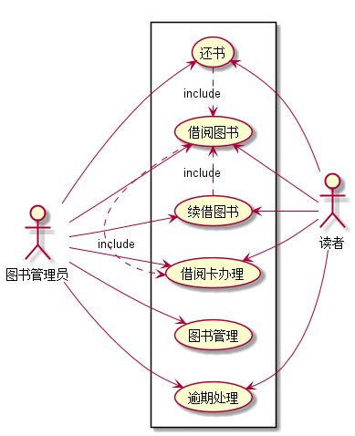

实验二:图书管理系统用例建模
|学号|班级|姓名|照片|
|:-------:|:-------------: | :----------:|:---:|
|201510414305|软件(本)15-3|黄友铭||


##用例图:图书管理系统

**PlantUML源码如下：**


```
@startuml
left to right direction

actor 图书管理员
actor 读者
rectangle  {
图书管理员 --> (图书管理)
图书管理员 --> (借阅图书)
图书管理员 --> (逾期处理)
图书管理员 --> (续借图书)
图书管理员 --> (借阅卡办理)
图书管理员 --> (还书)
(还书).>(借阅图书):extends
(续借图书).>(借阅图书):extends
(借阅图书).>(借阅卡办理):extends
(借阅图书) <-- 读者
(还书) <-- 读者
(续借图书) <-- 读者
(逾期处理)<--读者
(借阅卡办理)<--读者

}

@enduml
```

**用例图图如下：**



##参与者说明：

###图书管理员：
主要职责是：借出图书，管理图书，逾期处理，借阅卡办理，续借图书

###读者：
主要职责是：还书

##用例规范表：
###借出图书用例：
|用例名称|借出图书
|:-------:|:-------------: |
|参与者|图书管理员 读者|
|前置条件|读者前往前台办理借书手续|
|后置条件|图书管理员成功为读者办理借书手续|
|主事件流||
|参与者动作|系统行为|
|1.读者前往办理借书手续;| |
| |2.系统列出读者信息以及要借阅的图书信息;|
|3.图书管理员登记借书时间并告知读者还书期限;| |
| |4.系统保存相关信息，用例结束|
|备选事件流| 
|2a.没有该读者信息
1.系统提示无该用户信息，用例结束| |
|2b.没有该图书信息
1.系统提示无盖图书信息，用例结束| |
|业务规则|
|1.一位读者一次性只能借阅3本书，且最多只能借阅3本书。| |
|2.星期一不办理借出图书业务。| |


###还书用例：
|用例名称|还书|
|:-------:|:-------------: |
|参与者|图书管理员 读者|
|前置条件|读者前往前台办理还书手续|
|后置条件|图书管理员成功为读者办理还书手续，并将书归还到相应书架|
|主事件流||
|参与者动作|系统行为|
|1.读者前往办理还书手续;| |
| |2.系统列出读者信息以及该读者的借书情况;|
|3.图书管理员消去读者的相应借书状况;| |
| |4.系统保存相关信息，用例结束|
|备选事件流| 
|2a.没有该读者信息
1.系统提示无该用户信息，用例结束| |
|2b.没有该图书信息
1.系统提示无盖图书信息，用例结束| |
|3c.该图书借阅已经逾期
1.转往逾期处理流程,用例结束| |
|业务规则|
|1.若所还图书有一定程度上的损坏，读者应该进行赔偿。| |
|2.还书办理时只能由读者本人进行。| |

###管理图书用例：
|用例名称|图书管理|
|:-------:|:-------------: |
|参与者|图书管理员|
|前置条件|相应书籍存在|
|后置条件|相应书籍满足要求|
|主事件流||
|参与者动作|系统行为|
|1.图书管理员根据系统所存图书内容进行检查;| |
|2.图书管理员根据图书实际情况对系统数据进行修改| |
|3.图书管理员根据要求购进部分图书| |
| |4.系统保存相关信息，用例结束|
|备选事件流| 
|3a.未能购置该图书
1.图书管理员在系统上登记该图书未补充，用例结束| |
|业务规则|
|无| |

###逾期处理用例：
|用例名称|逾期处理|
|:-------:|:-------------: |
|参与者|图书管理员 读者|
|前置条件|读者办理还书时，所借图书超过借书期限|
|后置条件|无|
|主事件流||
|参与者动作|系统行为|
|1.图书管理员根据逾期时间计算违约赔付金额;| |
|2.读者支付相关金额;| |
|3.图书管理员消去读者的相应借书状况;| |
| |4.系统保存相关信息，用例结束|
|备选事件流| 
|2a.读者拒绝支付违约赔付金额
1.图书管理员取消该用户借阅图书资格，并将其拉入黑名单| |
|业务规则|
|1.逾期违约金额根据违约时间长短而定，逾期时间越长，金额越高。| |
|2.若读者办理续借手续则重新计算借书期限。| |


###借阅卡办理：
|用例名称|借阅卡办理|
|:-------:|:-------------: |
|参与者|图书管理员 读者|
|前置条件|该读者之前未办理信息注册|
|后置条件|无|
|主事件流||
|参与者动作|系统行为|
|1.图书管理员根据读者信息在系统中录入数据;| |
|2.读者支付押金办理相关证件;| |
|3.图书管理员开通该读者借阅资格;| |
| |4.系统保存相关信息，用例结束|
|备选事件流| 
|无| |
|业务规则|
|无||

###续借图书办理
|用例名称|借阅卡办理|
|:-------:|:-------------: |
|参与者|图书管理员 读者|
|前置条件|读者借阅图书|
|后置条件|无|
|主事件流||
|参与者动作|系统行为|
|1.图书管理员根据读者需求延长借书期限;| |
| |2.系统保存相关信息，用例结束|
|备选事件流| 
|无| |
|业务规则|
|1.续借最多延长2次，每次最多延长借书期限20天，超过时间依然按照逾期处理||
