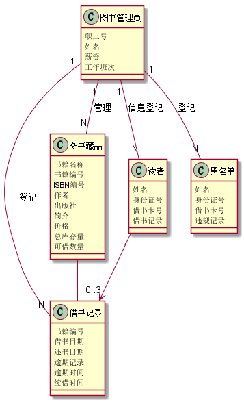
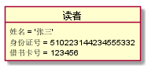
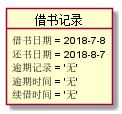
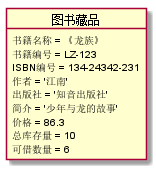
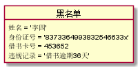
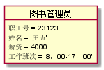

# 实验二:图书管理系统用例建模
|学号|班级|姓名|照片|
|:-------:|:-------------:|:----------:|:----:|
|201510414305|软件(本)15-3|黄友铭||

## 类图:图书管理系统

**PlantUML源码如下：**

```
@startuml

class 借书记录{
书籍编号
借书日期
还书日期
逾期记录
逾期时间
续借时间
}

class 图书管理员{
职工号
姓名
薪资
工作班次
}

class 图书藏品{
书籍名称
书籍编号
ISBN编号
作者
出版社
简介
价格
总库存量
可借数量
}

class 读者{
姓名
身份证号
借书卡号
借书记录
}

class 黑名单{
姓名
身份证号
借书卡号
违规记录
}

图书管理员  "1" -- "N" 借书记录 : 登记
图书管理员  "1" -- "N" 黑名单 : 登记
图书管理员  "1" -- "N" 图书藏品 : 管理
图书管理员  "1" -- "N" 读者 : 信息登记
图书藏品   --  借书记录
读者  "1" --> "0..3" 借书记录


@enduml

```

**类图图如下：**




 **类图说明：**
 
 ```
图书管理员类包括职工号，姓名，薪资，工作班次4个属性
读者类包括姓名，身份证号，借书卡号，借书记录4个属性
借书记录类包括书籍编号，借书日期， 还书日期，逾期记录， 逾期时间，续借时间6个属性
图书藏品类类包括书籍名称，书籍编号，ISBN编号，作者，出版社，简介，价格，总库存量，可借数量9个属性
黑名单类包括姓名，身份证号，借书卡号，违规记录4个属性

图书藏品类由图书管理用例产生，被图书借阅用例，还书用例，续借图书用例引用
借书记录类由图书借阅用例产生，被还书用例，续借图书用例，逾期处理用例引用
读者类由借阅卡办理用例产生，被逾期处理用例，还书用例，借阅图书用例引用
黑名单类由逾期处理用例产生
```

## 图书管理系统的对象图

### 读者类的对象图

#### 对象图如下



#### 源码如下
```
@startuml

object 读者{
姓名 = '张三'
身份证号 = '510223144234555332'
借书卡号 = 123456
}
@enduml
```

### 借书记录类的对象图

#### 对象图如下



#### 源码如下
```
@startuml

object 借书记录{
借书日期 = 2018-7-8
还书日期 = 2018-8-7
逾期记录 = '无'
逾期时间 = '无'
续借时间 = '无'
}
@enduml
```

### 图书藏品类的对象图

#### 对象图如下



#### 源码如下
```
@startuml

object 图书藏品{
书籍名称 = 《龙族》
书籍编号 = LZ-123
ISBN编号 = 134-24342-231
作者 = '江南'
出版社 = '知音出版社'
简介 = '少年与龙的故事'
价格 = 86.3
总库存量 = 10
可借数量 = 6
}

@enduml
```

### 黑名单类的对象图

#### 对象图如下



#### 源码如下
```
@startuml

object 黑名单{
姓名 = '李四'
身份证号 = '8373364993832546633x'
借书卡号 = 453652
违规记录 = '借书逾期36天'
}

@enduml
```

### 图书管理员类的对象图

#### 对象图如下



#### 源码如下
```
@startuml

object 图书管理员{
职工号 = 23123
姓名 = '王五'
薪资 = 4000
工作班次 = '8：00-17：00'
}

@enduml
```