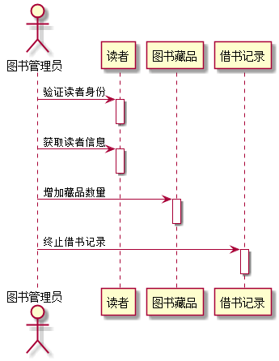

# 实验二:图书管理系统用例建模
|学号|班级|姓名|照片|
|:-------:|:-------------:|:----------:|:----:|
|201510414305|软件(本)15-3|黄友铭||

## 顺序图：信息登记

**PlantUML源码如下：**

```
@startuml

actor 图书管理员
participant "读者" as A


图书管理员 ->A :信息登记
activate A


A -> 图书管理员 :交定金
deactivate A

图书管理员 -> A :办理借阅卡
activate A
deactivate A

@enduml

```

**顺序图如下：**


 **顺序图说明：**


 ```
图书管理员首先登记读者的身份信息
然后读者向图书管理员支付押金
最后图书管理员为读者办理借阅卡并交付给读者


```

## 顺序图：借书用例

**PlantUML源码如下：**

```
@startuml

actor 图书管理员
participant "读者" as A
participant "图书藏品" as B
participant "借书记录" as C

activate 图书管理员

图书管理员 -> A: 验证读者身份
activate A
deactivate A

图书管理员 -> A:获取读者信息
activate A
deactivate A

图书管理员 -> B: 获取藏品信息
activate B
deactivate B

图书管理员 -> C: 创建借书记录
activate C
deactivate C

图书管理员 -> A:读者借书量增加
activate A
deactivate A

图书管理员 -> B :藏品数量减少
activate B
deactivate B

图书管理员 -> C:打印借书记录单
activate C
deactivate C


@enduml

```

**顺序图如下：**


 **顺序图说明：**


 ```
首先图书管理员验证借阅卡以及读者的身份
然后，获取读者的其它信息，包括已借书和借书剩余数
接下来，图书管理员查询读者想要借阅的书的信息
确认完毕后，为此次借书创建借书记录
之后，修改读者的可借书总量和图书的可借量
最后打印借书单

```


## 顺序图：还书用例

**PlantUML源码如下：**

```
@startuml

actor 图书管理员
participant "读者" as A
participant "图书藏品" as B
participant "借书记录" as C


图书管理员 -> A: 验证读者身份
activate A
deactivate A

图书管理员 -> A:获取读者信息
activate A
deactivate A

图书管理员 -> B:增加藏品数量
activate B
deactivate B

图书管理员 -> C:终止借书记录
activate C
deactivate C


@enduml

```

**顺序图如下：**




 **顺序图说明：**


 ```
首先，图书管理员验证读者身份信息
然后，图书管理员获取包括借书记录等读者信息
之后，修改相应数据
最后，终止此次借书记录

```


## 顺序图：逾期处理

**PlantUML源码如下：**

```
@startuml

actor 图书管理员 as A
participant "借书记录" as B
participant "读者" as C
participant "黑名单" as D


A -> B:验证借书记录是否逾期
activate B
deactivate B


A-> C :联系读者催促其还书或者进行续借
activate C
deactivate C

A-> B:为读者图书添加续借
activate B
deactivate B

A-> D :将消极应对的读者加入黑名单
activate D
deactivate D

@enduml

```

**顺序图如下：**


 **顺序图说明：**


 ```
首先，图书管理员验证是否有将要过期的结束记录
然后，图书管理员通过登记的信息发送催促信息给读者
之后，为想要续借的读者办理续借手续
最后，将消极应对的读者拉入黑名单，并且没收押金

```