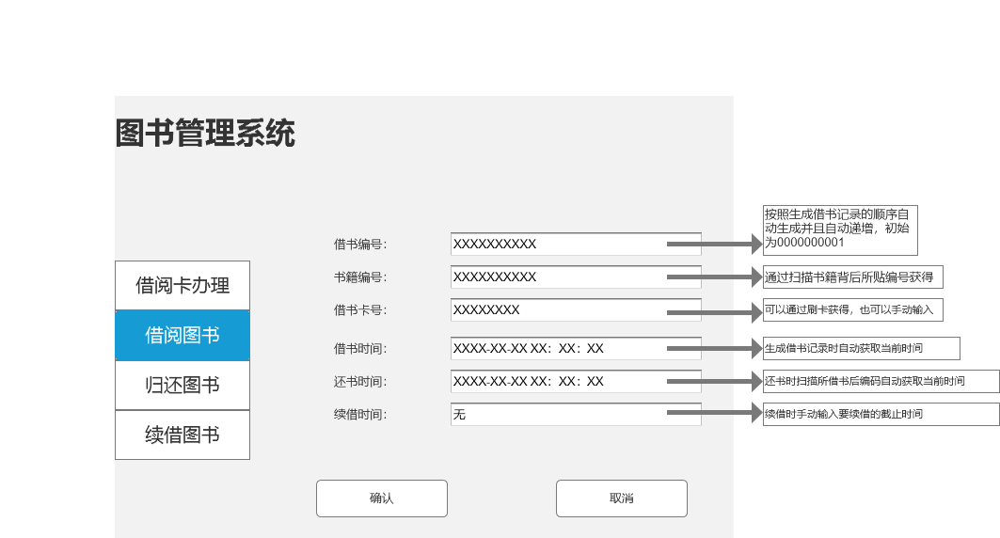

# 实验五:图书管理系统数据库设计与界面设计
|学号|班级|姓名|照片|
|:-------:|:-------------:|:----------:|:----:|
|201510414305|软件(本)15-3|黄友铭||


## 1.数据库表设计

## 1.1. 图书藏品表
|字段|类型|主键，外键|可以为空|默认值|约束|说明|
|:-------:|:-------------:|:------:|:----:|:---:|:----:|:-----|
|ISBN|varchar2(10)|主键|否||||
|书籍名称|varchar2(100)| |否||||
|书籍编号|varchar2(10)| |否||||
|作者|varchar2(100)| |是||||
|出版社|varchar2(100)| |是||||
|简介|varchar2(100)| |是||||
|价格|float2(100)| |否||||
|总库存量|int2(100)| |否||||
|可借数量|int2(100)| |否||||

## 1.2. 读者表
|字段|类型|主键，外键|可以为空|默认值|约束|说明|
|:-------:|:-------------:|:------:|:----:|:---:|:----:|:-----|
|身份证号|varchar2(13)|主键|否||||
|姓名|varchar2(100)| |否||||
|借书卡号|varchar2(8)| |否||||
|借书记录|varchar2(100)| |是||||


## 1.3. 图书管理员表
|字段|类型|主键，外键|可以为空|默认值|约束|说明|
|:-------:|:-------------:|:------:|:----:|:---:|:----:|:-----|
|职工号|varchar2(10)|主键|否||||
|姓名|varchar2(20)| |否||||
|薪资|varchar2(50)| |否||||
|班次|varchar2(100)| |否||||


## 1.4. 借书记录表
|字段|类型|主键，外键|可以为空|默认值|约束|说明|
|:-------:|:-------------:|:------:|:----:|:---:|:----:|:-----|
|借书编号|varchar2(10)|主键|否||||
|书籍编号|varchar2(10)| |否||||
|借书卡号|varchar2(8)| |否||||
|借书日期|varchar2(20)| |否||||
|还书日期|varchar2(20)| |否||||
|逾期记录|varchar2(100)| |是||||
|逾期时间|varchar2(20)| |是||||
|续借时间|varchar2(20)| |是||||

## 1.5. 黑名单表
|字段|类型|主键，外键|可以为空|默认值|约束|说明|
|:-------:|:-------------:|:------:|:----:|:---:|:----:|:-----|
|借书卡号|varchar2(8)|主键|否||||
|身份证号|varchar2(13)| |否||||
|姓名|varchar2(20)| |否||||
|违规记录|varchar2(100)| |否||||


## 2. 界面设计
## 2.1. 借书界面设计

- 用例图参见：借书用例
- 类图参见：借书类，读者类，借书记录类
- 顺序图参见：借书顺序图
- API接口如下：

1. 获取全部分类

- 功能：用于获取全部分类
- 请求地址： http://library/v1/api/borrow
- 请求方法：POST
- 请求参数：

|参数名称|必填|说明|
|:-------:|:-------------: | :----------:|
|access_token|是|验证图书和用户信息 |
|method|是|GET POST|

- 返回实例：
```
{
    "info": "图书信息",
    "data": {
                 "name":"《龙族》",
                 "number":"LZ-123"
                 "ISBN" : "134-24342-231"
                 "author" : "江南"
                 "publisher" : "知音出版社"
                 "abstract" : '少年与龙的故事'
                 "price" : 86.3
                 "total" : 10
                 "sum" :6
    },
    "code": 200
}
```
- 返回参数说明：
    
|参数名称|说明|
|:-------:|:-------------: |
|Info|返回信息|
|data|书籍信息|
|code|返回码|

