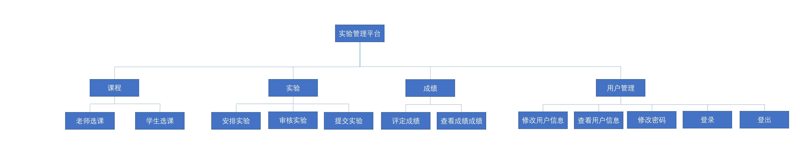
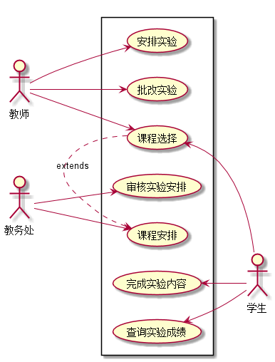
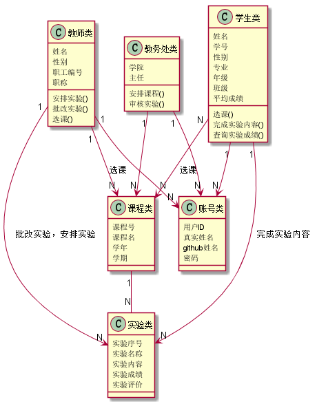

<!-- markdownlint-disable MD033-->
<!-- 禁止MD033类型的警告 https://www.npmjs.com/package/markdownlint -->

# 基于GitHub的实验管理平台的分析与设计

### 成都大学信息科学与工程学院

|学号|班级|姓名|照片|
|:-------:|:-------------: | :----------:|:---:|
|201510414305|软件(本)15-3|黄友铭||

## 1. 概述
- 基于GitHub的实验管理平台的作用是在线管理实验成绩的Web应用系统。学生和老师的实验内容均存放在GitHUB
页面上。
- 学生的功能主要有：一是设置自己的GitHub用户名，二是选课，三是根据老师实验要求完成实验内容，四是查询自己的实验成绩。学生的GitHub用户名是公开的，但成绩不公开。
- 老师的功能主要有：一是选课，二是安排实验，三是批改每个学生的成绩。
- 老师安排的实验只有通过了教务出的审核才会被发布到平台上。
- 选课先由老师选，再由学生选。老师可以选择要任教的选修课和必修课，学生只能选择要上的选修课。
- 老师和学生都能通过本系统的链接方便地跳转到学生的每个GitHUB实验目录，以便批改实验或者查看实验情况。
- 实验成绩按数字分数计算，每项实验的满分为100分，最低为0分。
- 系统自动计算每个学生的所有实验的平均分。
    
## 2. 系统总体结构

    
## 3. 用例图设计 [源码](用例图.puml)

## 4. 类图设计 [源码](类图.puml)

## 5. 数据库设计
- ### [参见数据库设计](./数据库设计.md)

## 6. 用例及界面详细设计
- ### [“修改密码”用例](./用例/修改密码.md),[界面](https://github.io/hym19970721/is_analysis/test6/界面图/修改密码.html)
- ### [“选课”用例](./用例/选课.md),[界面](https://github.io/hym19970721/is_analysis/test6/界面图/选课(学生).html)
- ### [“查询实验成绩”用例](./用例/查询实验成绩.md),[界面](https://github.io/hym19970721/is_analysis/test6/界面图/查询实验成绩.html)
- ### [“修改用户信息”用例](./用例/修改用户信息.md),[界面](https://github.io/hym19970721/is_analysis/test6/界面图/信息界面.html)
- ### [“安排实验”用例](./用例/安排实验.md),[界面](https://github.io/hym19970721/is_analysis/test6/界面图/安排实验.html)
- ### [“完成实验内容”用例](./用例/完成实验内容.md),[界面](https://github.io/hym19970721/is_analysis/test6/界面图/完成实验内容.html)
- ### [“查看用户信息”用例](./用例/查看用户信息.md),[界面](https://github.io/hym19970721/is_analysis/test6/界面图/信息界面.html)
- ### [“登出”用例](./用例/登出.md),[界面](https://github.io/hym19970721/is_analysis/test6/界面图/主界面.html)
- ### [“登录”用例](./用例/登录.md),[界面](https://github.io/hym19970721/is_analysis/test6/界面图/登录.html)
    
