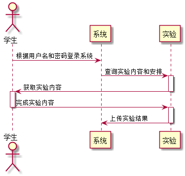

#完成实验内容用例[返回](../README.md)
## 1. 用例规约

|用例名称|完成实验内容|
|-------|:-------------|
|功能|学生根据老师安排的实验要求完成实验内容|
|参与者|学生|
|前置条件|学生需要先登陆|
|后置条件||
|主流事件| |
|备注| |

## 2. 业务流程[源码](../顺序图/完成实验内容.puml)
 

## 3. 界面设计
- 界面参照: https://github.com/hym19970721/is_analysis/test6/界面图/完成实验内容.html
- API接口调用
    - 接口1：[setTest](../接口/setTest.md)

## 4. 算法描述
- WEB_SUM解析为列表  
  - WEB_SUM是接口getTest的返回值中的一部分，形如："WEB_SUM": "Y,Y,Y,Y,Y,N"。需要在前端进行解析。  
  - 作用是判断GitHub网址是否正确，用逗号分开，Y代表正确，N代表不正确。  
  - 第1位代表总的GitHUB地址是否正确，第2位表示第1次实验的地址，第3位表示第2位实验地址，依此类推。
  - 比如：“Y,Y,Y,Y,Y,N”表示第5次实验地址不正确，其他地址正确。  
  - 算法是使用使用字符串分离方法将其分开。

    
## 5. 参照表

- [TEST](../数据库设计.md/#TEST)
- [STUDENTS](../数据库设计.md/#STUDENTS)